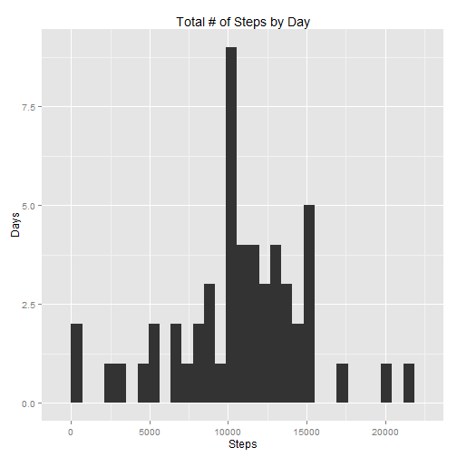

**************

**Loading and preprocessing the data**  

Show any code that is needed to  

1. Load the data (i.e. read.csv())  

```r
activity <- read.table( "activity.csv", header = T, sep = "," )
```
2. Process/transform the data (if necessary) into a format suitable for your analysis  

```r
# Change the date variable into true date format
activity$date.POSIXct <- as.POSIXct( activity$date )

# Load libraries to be used for analyses
library(dplyr)      
```

```
## 
## Attaching package: 'dplyr'
## 
## The following objects are masked from 'package:stats':
## 
##     filter, lag
## 
## The following objects are masked from 'package:base':
## 
##     intersect, setdiff, setequal, union
```

<br>  
**What is mean total number of steps taken per day?**

For this part of the assignment, you can ignore the missing values in the dataset.  

1. Calculate the total number of steps taken per day  

```r
# Ignore days with NA steps
act.complete <- activity[ complete.cases(activity), ]

# Group by day then sum steps
act.by.day <- group_by( act.complete, date )
act.steps.by.day <- summarize( act.by.day, tot.steps = sum( steps, na.rm=TRUE ) )
head( act.steps.by.day, 5 )
```

```
## Source: local data frame [5 x 2]
## 
##         date tot.steps
## 1 2012-10-02       126
## 2 2012-10-03     11352
## 3 2012-10-04     12116
## 4 2012-10-05     13294
## 5 2012-10-06     15420
```
2. If you do not understand the difference between a histogram and a barplot, research the difference between them. Make a histogram of the total number of steps taken each day

```r
# Load graphical library
library( ggplot2 )
```

```
## 
## Attaching package: 'ggplot2'
## 
## The following object is masked _by_ '.GlobalEnv':
## 
##     diamonds
```

```r
qplot( x = tot.steps, data = act.steps.by.day, geom = "histogram" ) + 
  labs( title = "Total # of Steps by Day", x = "Steps", y = "Days" )
```

```
## stat_bin: binwidth defaulted to range/30. Use 'binwidth = x' to adjust this.
```

 

3. Calculate and report the mean and median of the total number of steps taken per day

```r
mean.steps <- mean( act.steps.by.day$tot.steps )
med.steps <- median( act.steps.by.day$tot.steps )
```
*The mean of the total number of steps taken per day (ignoring days with missing values) is 10,766.19.*  
*The median of the total number of steps taken per day (ignoring days with missing values) is 10,765.*

<br>  
**What is the average daily activity pattern?**

1. Make a time series plot (i.e. type = "l") of the 5-minute interval (x-axis) and the average number of steps taken, averaged across all days (y-axis)

```r
# Group by interval, then calc average steps
act.by.int <- group_by( act.complete, interval )
avg.steps.by.int <- summarize( act.by.int, avg.steps = mean( steps, na.rm=TRUE ) )

# Plot the time-series of average steps over intervals
qplot( interval, avg.steps, data = avg.steps.by.int, geom = "line" ) + 
  labs( title = "Average Steps By 5-Minute Interval", x = "Interval", y = "# of Steps" )
```

 

2. Which 5-minute interval, on average across all the days in the dataset, contains the maximum number of steps?

```r
# Locate interval with max average steps
max.int <- avg.steps.by.int$interval[ which.max( avg.steps.by.int$avg.steps ) ]
```

*The interval that contains the maximum average number of steps is 835.*  
<br>  
**Imputing missing values**  
Note that there are a number of days/intervals where there are missing values (coded as NA ). The presence of missing days may introduce bias into some calculations or summaries of the data.

1. Calculate and report the total number of missing values in the dataset (i.e. the total number of rows with NAs)

```r
summary(activity)
```

```
##      steps                date          interval     
##  Min.   :  0.00   2012-10-01:  288   Min.   :   0.0  
##  1st Qu.:  0.00   2012-10-02:  288   1st Qu.: 588.8  
##  Median :  0.00   2012-10-03:  288   Median :1177.5  
##  Mean   : 37.38   2012-10-04:  288   Mean   :1177.5  
##  3rd Qu.: 12.00   2012-10-05:  288   3rd Qu.:1766.2  
##  Max.   :806.00   2012-10-06:  288   Max.   :2355.0  
##  NA's   :2304     (Other)   :15840                   
##   date.POSIXct                
##  Min.   :2012-10-01 00:00:00  
##  1st Qu.:2012-10-16 00:00:00  
##  Median :2012-10-31 00:00:00  
##  Mean   :2012-10-31 00:25:34  
##  3rd Qu.:2012-11-15 00:00:00  
##  Max.   :2012-11-30 00:00:00  
## 
```
*Looking at the summary all the NA's are in the "steps" variable. Capture it and report.*

```r
num.na <- sum( is.na( activity$steps ) )
```
*The total number of rows with NAs are 2,304.*

2. Devise a strategy for filling in all of the missing values in the dataset. The strategy does not need to be sophisticated. For example, you could use the mean/median for that day, or the mean for that 5-minute interval, etc.  

*I am choosing to proxy missing values with averages for each 5-minute interval.*  

*Recall from above that we created a data frame that stores average steps by interval. We can use that to replace the NAs.*  

3. Create a new dataset that is equal to the original dataset but with the missing data filled in.

```r
# Create data frame that joins in average steps by interval
act.new <- merge( activity, avg.steps.by.int, by="interval", sort=FALSE )

# Create temp variable that replaces NAs with average steps
act.new$steps.temp <-ifelse( is.na(act.new$steps), act.new$avg.steps, act.new$steps )
act.new$steps <- act.new$steps.temp # Replace values of "steps" variable
act.new <- act.new[,-(5:6)]         # Delete temporary variables 
summary( act.new )
```

```
##     interval          steps                date      
##  Min.   :   0.0   Min.   :  0.00   2012-10-01:  288  
##  1st Qu.: 588.8   1st Qu.:  0.00   2012-10-02:  288  
##  Median :1177.5   Median :  0.00   2012-10-03:  288  
##  Mean   :1177.5   Mean   : 37.38   2012-10-04:  288  
##  3rd Qu.:1766.2   3rd Qu.: 27.00   2012-10-05:  288  
##  Max.   :2355.0   Max.   :806.00   2012-10-06:  288  
##                                    (Other)   :15840  
##   date.POSIXct                
##  Min.   :2012-10-01 00:00:00  
##  1st Qu.:2012-10-16 00:00:00  
##  Median :2012-10-31 00:00:00  
##  Mean   :2012-10-31 00:25:34  
##  3rd Qu.:2012-11-15 00:00:00  
##  Max.   :2012-11-30 00:00:00  
## 
```
*Note that the variable "steps" no longer has NAs.*

4. Make a histogram of the total number of steps taken each day and Calculate and report the mean and median total number of steps taken per day. Do these values differ from the estimates from the first part of the assignment? What is the impact of imputing missing data on the estimates of the total daily number of steps?

```r
# Get updated steps by day, then plot histogram
act.by.day.new <- group_by( act.new, date )
act.steps.by.day.new <- summarize( act.by.day.new, tot.steps = sum( steps, na.rm=TRUE ) )
head( act.steps.by.day.new, 5 )
```

```
## Source: local data frame [5 x 2]
## 
##         date tot.steps
## 1 2012-10-01  10766.19
## 2 2012-10-02    126.00
## 3 2012-10-03  11352.00
## 4 2012-10-04  12116.00
## 5 2012-10-05  13294.00
```

```r
qplot( x = tot.steps, data = act.steps.by.day.new, geom = "histogram" ) + 
  labs( title = "Total # of Steps by Day, Imputed NAs", x = "Steps", y = "Days" )
```

```
## stat_bin: binwidth defaulted to range/30. Use 'binwidth = x' to adjust this.
```

 

```r
# Calculate updated mean and median
mean.steps.new <- mean( act.steps.by.day.new$tot.steps )
med.steps.new <- median( act.steps.by.day.new$tot.steps )
```
*The mean of the total number of steps taken per day after imputing NAs is 10,766.19. This is the same as the mean calculated before and makes sense based on the nature of the missing data.  It appears that when there were NAs it was for the entire day.  Therefore since we are using average steps by interval, and their total equals the mean steps by day, then replacing "NA days" with the "new" days with the same mean won't change the overall mean.*    

*The median of the total number of steps taken per day after imputing NAs is 10,766.19. This is different from the median before, which is not surprising, because we are adding more data points.  It is also actually equal to the mean, which also is not surprising.  Since we are replacing a number of entire days with means equal to the overall mean (as shown above), then we in essense inserting days that fall in the center of the distribution, hence the likelihood that the median will actually overlap with these days increases.*  

<br>

**Are there differences in activity patterns between weekdays and weekends?**  

For this part the weekdays() function may be of some help here. Use the dataset with the filled-in missing values for this part.

1. Create a new factor variable in the dataset with two levels - "weekday" and "weekend" indicating whether a given date is a weekday or weekend day.

```r
# Create variable that extracts day of the week
act.new$dow <- weekdays( act.new$date.POSIXct, TRUE )
head(act.new)
```

```
##   interval    steps       date date.POSIXct dow
## 1        0 1.716981 2012-10-01   2012-10-01 Mon
## 2        0 0.000000 2012-11-23   2012-11-23 Fri
## 3        0 0.000000 2012-10-28   2012-10-28 Sun
## 4        0 0.000000 2012-11-06   2012-11-06 Tue
## 5        0 0.000000 2012-11-24   2012-11-24 Sat
## 6        0 0.000000 2012-11-15   2012-11-15 Thu
```

```r
# Create weekday/weekend mapping table
dow<-c( "Mon", "Tue", "Wed", "Thu", "Fri", "Sat", "Sun" )
day.type <- c( "weekday","weekday","weekday","weekday","weekday","weekend","weekend")
dow.map <- as.data.frame( cbind( dow, day.type ) )
dow.map
```

```
##   dow day.type
## 1 Mon  weekday
## 2 Tue  weekday
## 3 Wed  weekday
## 4 Thu  weekday
## 5 Fri  weekday
## 6 Sat  weekend
## 7 Sun  weekend
```

```r
# Map in weekend/weekday
act.new <- merge( act.new, dow.map, by="dow", sort = FALSE )
```
2. Make a panel plot containing a time series plot (i.e. type = "l" ) of the 5-minute interval (x-axis) and the average number of steps taken, averaged across all weekday days or weekend days (y-axis). See the README file in the GitHub repository to see an example of what this plot should look like using simulated data.

```r
#Group by weekday/weekend and interval, then calc average steps
act.by.day.type <- group_by( act.new, day.type, interval )
avg.steps.by.day.type.int <- summarize( act.by.day.type, avg.steps = mean( steps, na.rm=TRUE ) )

qplot( interval, avg.steps, data = avg.steps.by.day.type.int, geom = "line", facets = day.type ~ . ) + 
      labs( title = "Avg # of Steps by Day Type and Inteval", x = "Interval", y = "# of Steps" )
```

 
